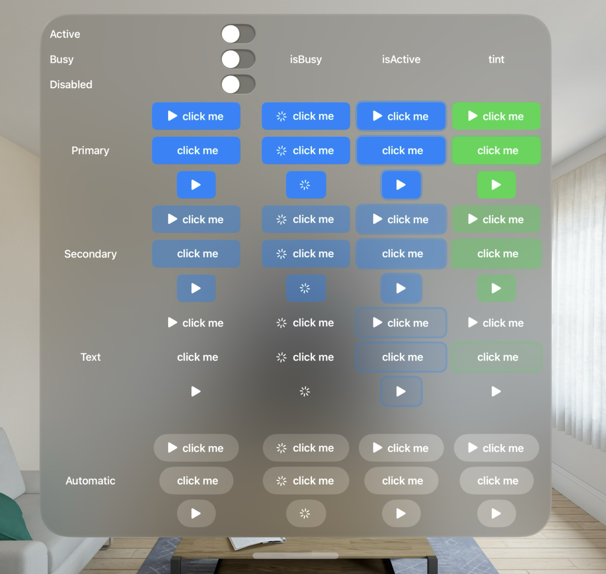
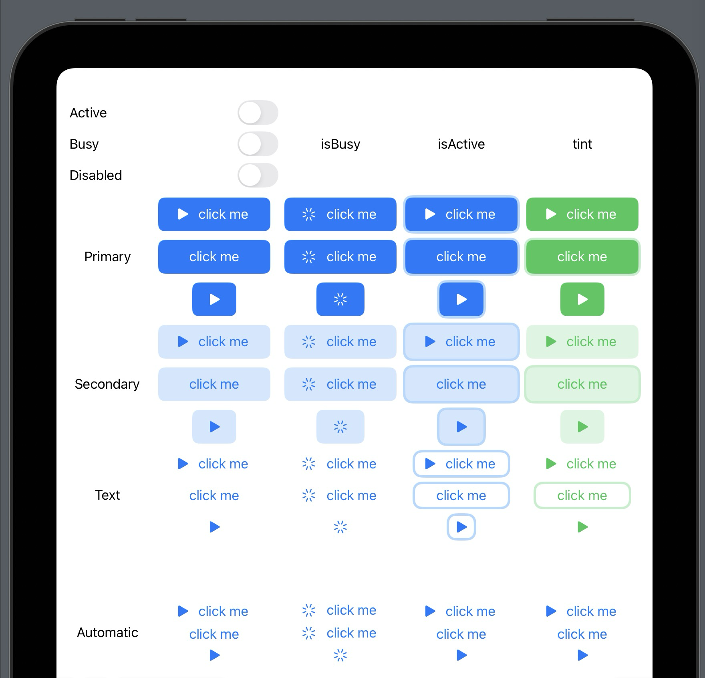
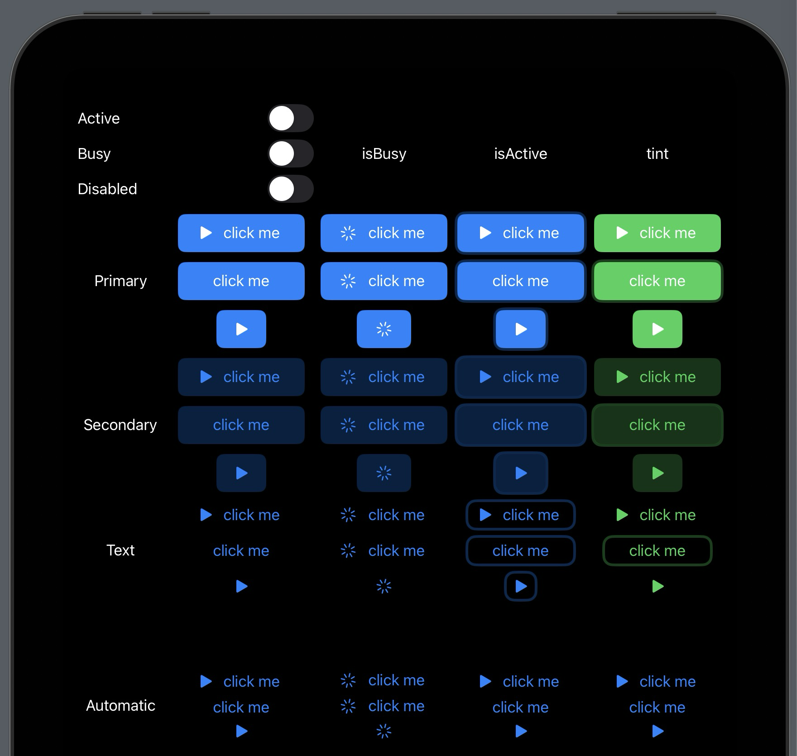
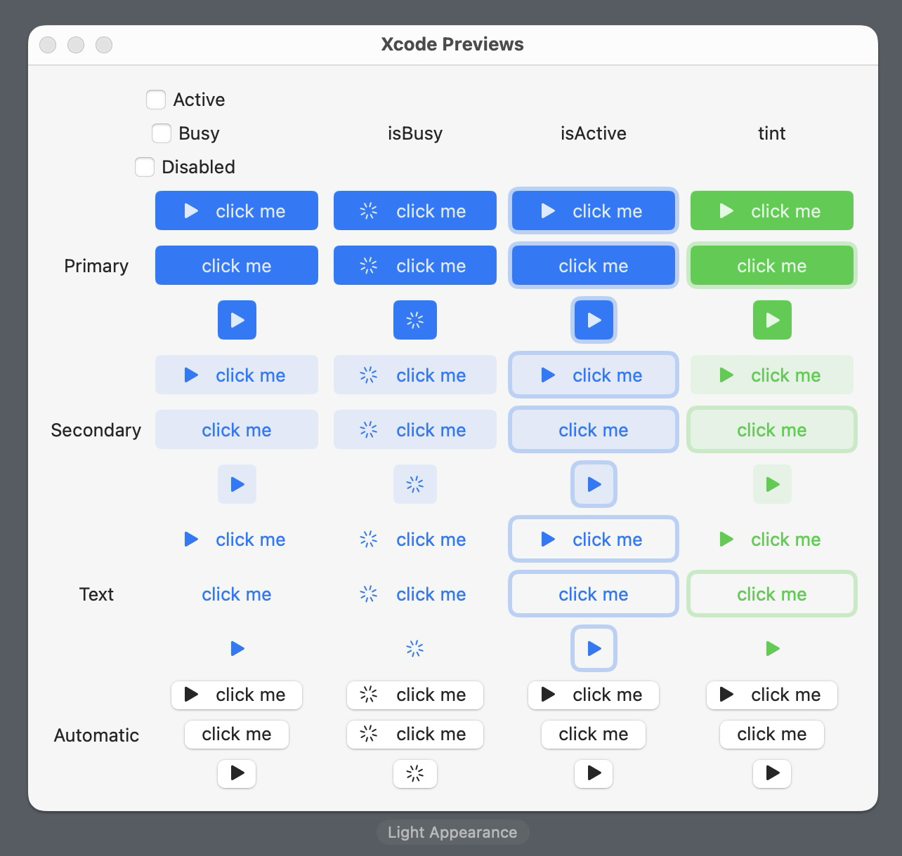
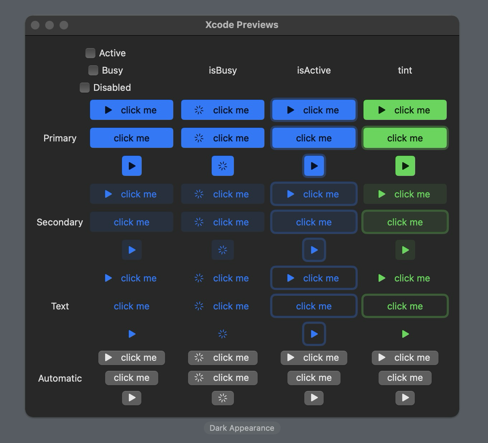

# Mirage 🏝️

[](https://swiftpackageindex.com/mesqueeb/Mirage)
[](https://swiftpackageindex.com/mesqueeb/Mirage)

```
.package(url: "https://github.com/mesqueeb/Mirage", from: "0.0.1")
```

A SwiftUI component library.

The rendered documentation can be found here: [swiftpackageindex.com/mesqueeb/Mirage/documentation](https://swiftpackageindex.com/mesqueeb/Mirage/documentation)

## Components

### MButton

### visionOS



### iOS / iPadOS





### macOS




